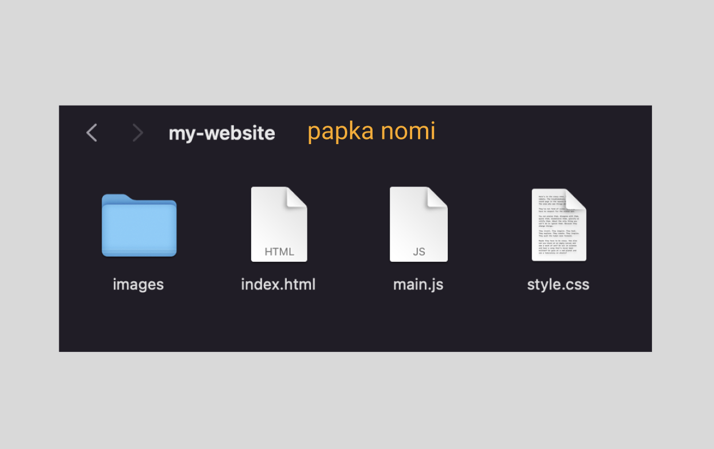
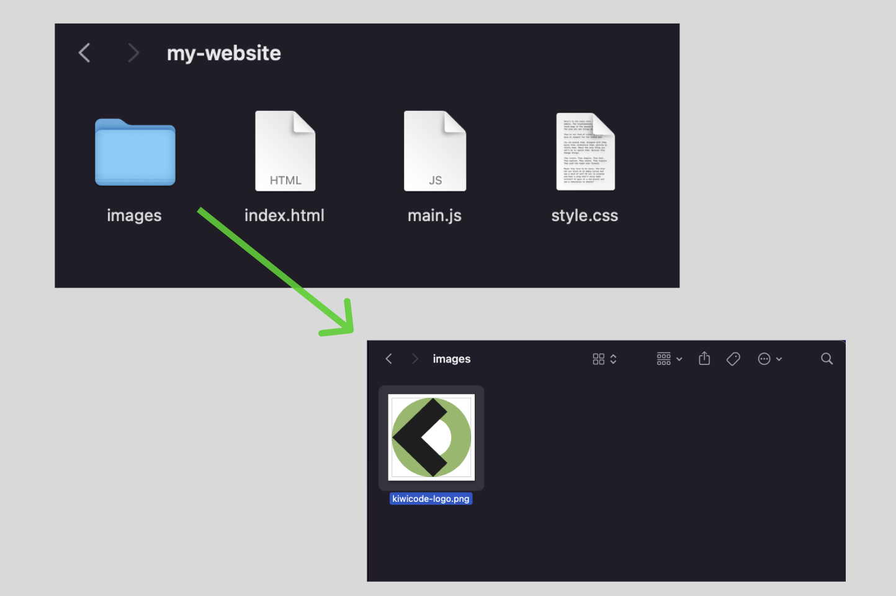
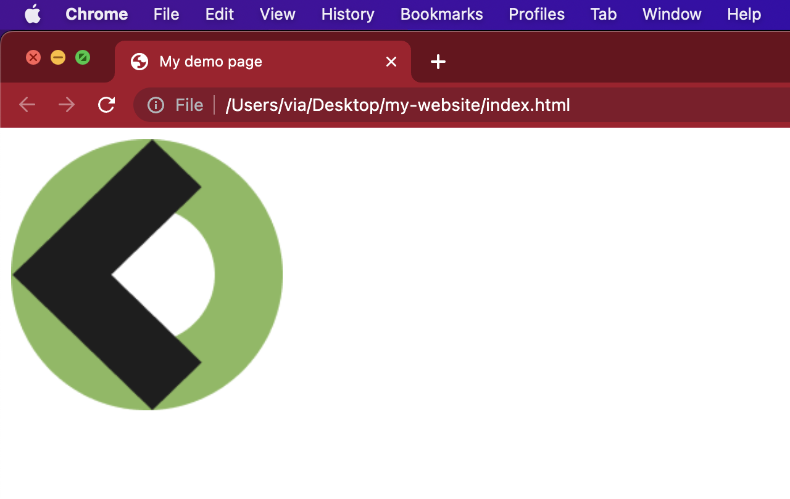

# 1. HTML coding practice

## Fayllar bilan ishlash

**Website**(veb-sahifa) bir nechta fayllardan iborat bo'ladi. Eng oddiy *website*ning _"papka"_ ko'rinishi shunga o'xshaydi:


`index.html`: Ushbu fayl HTML codeni o'z ichiga oladi.

`style.css`: Ushbu faylda kontentingizni style berish uchun foydalaniladigan CSS kodlari bo'ladi (masalan, matn va fon ranglarini o'zgartish).

`main.js`: Ushbu faylda saytingizga interaktiv funksiyalar qoʻshish uchun foydalaniladigan barcha JavaScript code yoziladi (masalan, bosilganda websahifa rangini o'zgartiradigan tugmalar).

`images` papkasi: Ushbu papkada saytingizda foydalanadigan barcha rasmlar saqlanadi.

## Kichik veb-sahifa(cha)

Keling bir kichik website yasab ko'ramiz 🤓. Kompyuteringizning birorta papkasida, masalan Desktop, `my-website` degan papka oching va uning ichiga yuqoridagi rasmda ko'rsatilgan fayllarni yasang.

`my-website` degan papka ushbu ko'rinishda bo'lishi kerak:



1. `images` papkasiga birorta rasm joylang. Ushbu _demo_ uchun men shu rasmni qo'ydim:



2. `index.html` faylingizni oching va quyida ko'rsatilgan kodni faylga kiriting. Hozircha bularning barchasi nimani anglatishi haqida tashvishlanmang - biz ushbu tuzilmalarni keyinroq yana batafsil ko'rib chiqamiz.

```html title="index.html"
<!DOCTYPE html>
<html lang="en-US">
  <head>
    <meta charset="utf-8" />
    <meta name="viewport" content="width=device-width" />
    <title>My demo page</title>
  </head>
  <body>
    
  </body>
</html>
```

2. `` - ushbu HTML code veb-sahifaga rasm joylashda ishlatiladi. Lekin HTML rasm qayerda ekanligini bilmaydi, chunki, `src=""` attribute bo'sh. Biz ishlatmoqchi bo'lga rasm `images` papkasini ichida va u `index.html` fayli bilan bitta papkada joylashgan. `index.html` dan turib `images` papkasidagi rasmga yo'l ushbu ko'rinishda bo'ladi: `images/sizning-rasm-nomi`. Men ushbu misol uchun tanlagan rasm nomi `kiwcode-logo.png` deb ataladi, shuning uchun fayl yo'li - `images/kiwicode-logo.png`.

3. Fayl yo'lini (mening misolimda `images/kiwicode-logo.png`) `src=""`ning qo'sh tirnoq belgilari orasiga kiriting.

4. `alt` *attribute*ning ichiga esa rasmni ifodalovchi ma'lumotni kiriting. Misol uchun. `alt="kiwicodecampning logosi"`.

5. `index.html` faylini _save_ (сохранить 😁) qiling. Tayyor HTML code ushbu ko'rinishda bo'lishi kerak:

```html title="index.html"
<!DOCTYPE html>
<html lang="en-US">
  <head>
    <meta charset="utf-8" />
    <meta name="viewport" content="width=device-width" />
    <title>My demo page</title>
  </head>
  <body>
    
  </body>
</html>
```

Endi ushbu fayl ustiga ikki marotaba bosib uni browseringizda oching va `"ta-da!"`:



Tabriklations! Birinchi veb-sahifa(cha)ngizni yasadingiz 🥳. (Agarda sizda ishlamagan bo'lsa, demak qayerdadir birorta narsani tushurib qoldirgansiz. Yaxshilab tekshiring!)

Endi nima? O'ylaymanki oz bo'lsa ham HTML haqida bilib oldingiz. Yuqoridagi HTML *code*ni o'zingiz bir o'zrgartirib "experiment" qilib ko'ring. Albatta _code_ yozish bilangina _code_ yozishni o'rganish mumkin.

## HTML5 document anatomiyasi

Shunday qilib *element*lar haqida basic(boshlang'ich) tushunchaga ega bo'ldingiz. (Yoki shunday deb umid qilaman 😅). Lekin, *element*larning o'zlari unchalik ham foydali emas. Hamma kuch turli xil elemenetlarni birlashtirib butun boshli _HTML page_ yaratishda dir 💪.
Yangi veb-sayt qurayotganda, yaxshi boshlang'ich poydevorga ega bo'lish muhimdir.

Keling, index.html ga qo'ygan kodimizni qayta ko'rib chiqaylik:

```html title="index.html"
<!DOCTYPE html>
<html lang="en-US">
  <head>
    <meta charset="utf-8" />
    <meta name="viewport" content="width=device-width" />
    <title>My demo page</title>
  </head>
  <body>
    
  </body>
</html>
```

Bizda quyidagilar mavjud:

- `<!DOCTYPE html>` - HTML *code*da birinchi qatorda keladi va ushbu code *HTML*ni 5-versiyasi ekanligini belgilaydi. Hozirgi kunda zamonaviy *browser*lar HTML5 ni _support_ qiladi.

- `<html></html>` - _root(ildiz) element_ bo'lib, ushbu _element_ butun sahifadagi barcha *content*ni o'rab oladi.

- `<head></head>` - ushbu _element_ veb-sahifadagi *user(website foydalanuvchisi)*ga ko'rinmaydigan barcha ma'lumotlar uchun _container_ vazifasini bajaradi.

- `<meta charset="utf-8">` — ushbu _element_ veb-sahifa foydalanishi kerak bo'lgan belgilar to'plamini **UTF-8** formatiga o'girib beradi. UTF-8 formati ko'pchilik yozma tillardagi belgilarni o'z ichiga oladi. Misol uchun evro belgisi (**€**) UTF-8 formatida `U+20AC`ga tarjima bo'ladi va bu formatni browserlar tushuna oladi.

- `<meta name="viewport" content="width=device-width">` — ushbu _element_ sahifani _viewport_ (ko'rish oynasi) kengligida ko'rsatishni ta'minlaydi, mobil *browser*lar sahifalarni ko'rish oynasidan kengroq ko'rsatishga va keyin ularni qisqartirishga yo'l qo'ymaydi. (O'zbekchada tushuntirish qiyin ekan shunisini 😅. Hali yana misollar bilan tushuntiriladi. Don't worry!)

- `<title></title>` - bu sizning sahifangizning sarlavhasini o'z ichiga oladi, ya'ni browserda *tab*da ko'rinib turuvchi sarlavha.

- `<body></body>` - bu _element_ *web user*ingizga sahifangizga tashrif buyurganlarida ko'rsatmoqchi bo'lgan barcha *content*ni o'z ichiga oladi.

Umid qilamanki, mening tushuntirishlarim sizga hozirgacha mantiqiy bo'ldi. Endi siz mini-saytimizni qurishni davom ettiradigan keyingi bo'limga o'tishingiz mumkin ✅
