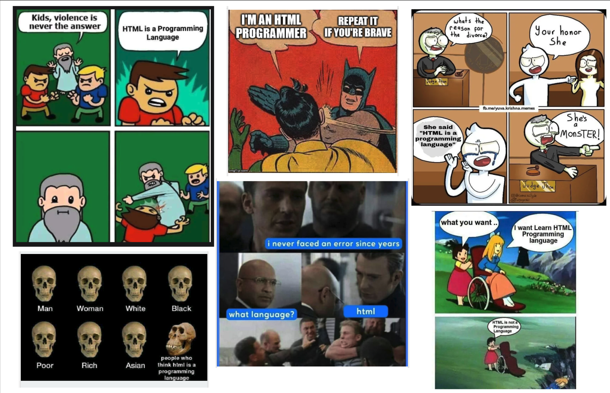
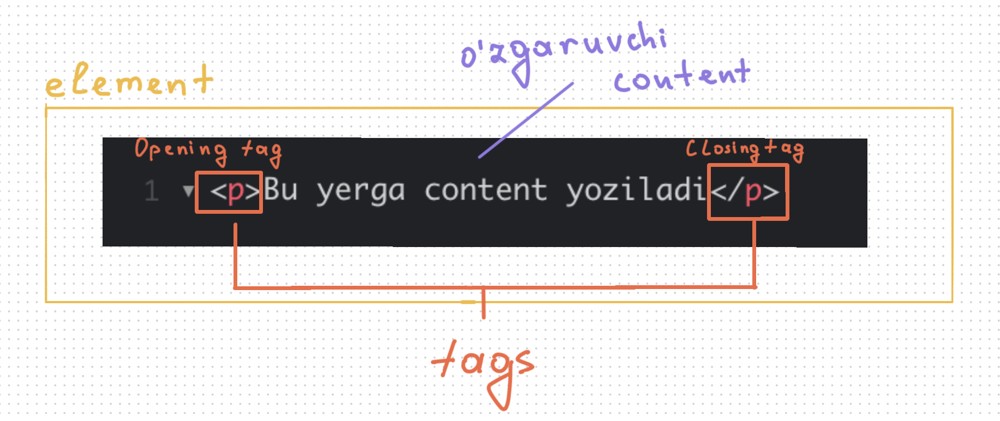

# HTML nima?

Internetda "HTML dasturlash tilimi yoki yo'qmi" degan ko'p argumentlar va _meme_ mavjud:



Lekin bir narsa aniq, **HTML** veb-sahifalarni yasash uchun standart _markup_ tili hisoblanadi va *HTML*siz _website_ yasay olmaymiz. _HTML_ - **H**yper **T**ext **M**arkup **L**anguage bo'lib, webdagi *content*ni ma'nosi va tuzilishini belgilaydi. *HTML*dan tashqari boshqa texnologiyalar odatda veb-sahifaning ko'rinishini (CSS) yoki funksionalligi (JavaScript) tasvirlash uchun ishlatiladi.

Hozir siz *HTML*ni o'rganypsiz, shuning uchun siz "HTML dasturlash tili va men dasturchiman" - deb tortishsangiz bo'ladi 😅. (Agarda isbotlab ber deyishsa [ushbu blogni](https://javascript.plainenglish.io/html-is-a-programming-language-prove-me-wrong-7c1ab0c9b8f9) o'qib ko'ring 😎).

## Oddiy HTML strukturasi

Pastda eng oddiy HTML code ko'rsatilgan:

```html title="index.html"
<!DOCTYPE html>
<html>
  <head>
    <title>Kiwi Title</title>
  </head>
  <body>
    <h1>Heading h1</h1>
    <p>Paragraph p</p>

    <section></section>

    <footer>© 2023 kiwiCodeCamp.</footer>
  </body>
</html>
```

Yuqoridagi HTML codeni browswerdagi ko'rinishi 👇

<iframe width="100%" height="300" src="//jsfiddle.net/nomanoff/p78zxmnq/3/embedded/result/" allowfullscreen="allowfullscreen" allowpaymentrequest frameborder="0"></iframe>

### Yuqoridagi HTML code:

- `<!DOCTYPE html>` - HTML *code*da birinchi qatorda keladi va ushbu code *HTML*ni 5-versiyasi ekanligini belgilaydi. Hozirgi kunda zamonaviy *browser*lar HTML5 ni _support_ qiladi.

- `<html></html>` - _root element_ bo'lib, ushbu _element_ butun sahifadagi barcha *content*ni o'rab oladi.

- `<head></head>` - ushbu _element_ veb-sahifadagi *user(website foydalanuvchisi)*ga ko'rinmaydigan barcha ma'lumotlar uchun _container_ vazifasini bajaradi.

- `<title></title>` - bu sizning sahifangizning sarlavhasini o'z ichiga oladi, ya'ni browserda *tab*da ko'rinib turuvchi sarlavha.

- `<body></body>` - bu _element_ *web user*ingizga sahifangizga tashrif buyurganlarida ko'rsatmoqchi bo'lgan barcha *content*ni o'z ichiga oladi.

- `<h1></h1>` - ushbu _element_ katta sarlavhani belgilaydi.
- `<p></p>` - *element*i paragrafni belgilaydi.

- `<section></section>` - bu _element_ *document*ning umumiy mustaqil qismini ifodalaydi.

- `<footer></footer>` - *document*ning mualliflik, mualliflik huquqi, telefon raqami va boshqa shunga o'xshash ma'lumotlarni ko'rsatish uchun ishlatiladi.

E'tibor qilgan bo'lsangiz yuqoridagi *HTML code*ni tushuntirish mobaynida hammasi **_element_** deb nomlangan. Chunki, HTML bir nechta shularga o'xshash *element*lardan tashkil topgan. Misol tariqasida ` <header>`, `<article>`, `<section>`, `<div>`, `<span>`, ``, `<aside>`, `<audio>`, `<canvas>`, `<datalist>`, `<details>`, `<embed>`, `<nav>`, `<output>`, `<progress>`, `<video>`, `<ul>`, `<ol>`, `<li>` va boshqalarni keltirishim mumkin.

HTML *element*i *document*dagi boshqa matndan **tag**lar orqali ajratiladi, ular **"<"** va **">"** bilan o'ralgan element nomidan iborat.

:::tip tag va element

"tag" deb `<p>` va `</p>` ga aytiladi. "element" esa ochilish "tag"i, yopish "tag"i va _content_ ni o'z ichiga oladi. Masalan, `<p>This is the content</p>` - bu element.

:::

_Tag_ lar case insensitive hisoblanadi (katta-kichik harflarga sezgir emas). Ya'ni, u katta, kichik yoki aralash yozilishi mumkin. Masalan, `<title>` *tag*i `<Title>`,` <TITLE>` yoki boshqa usulda yozilishi mumkin. Biroq, _conventional_ (konventsiya) va _recommended_ (tavsiya etilgan) yo'l *tag*larni kichik harflar bilan yozishdir.

## HTML elementi anatomiyasi



Yuqoridagi chizmada ko'rsatilganidek (yozganlarimni tushundingiz degan umiddaman 😅) **Opening tag** (bu holda, `p`) _angle brackets_(burchakli qavs) lariga o'ralgan.

**Closing tag** - bu _opening tag_ bilan bir xil, faqat `p` *component*idan oldin _forward slash_ `/` (to'g'ri chiziq)ni o'z ichiga oladi. Bu element qaerda tugashini bildiradi. *Closing tag*ni tushurib qoldirish xato hisoblanadi va g'alati natijalarga olib kelishi mumkin.
