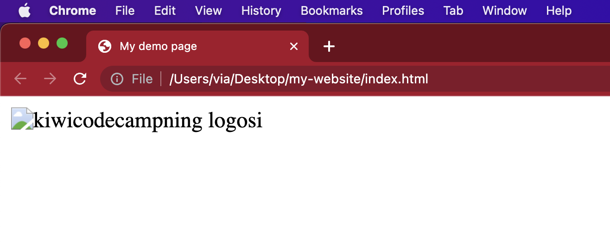
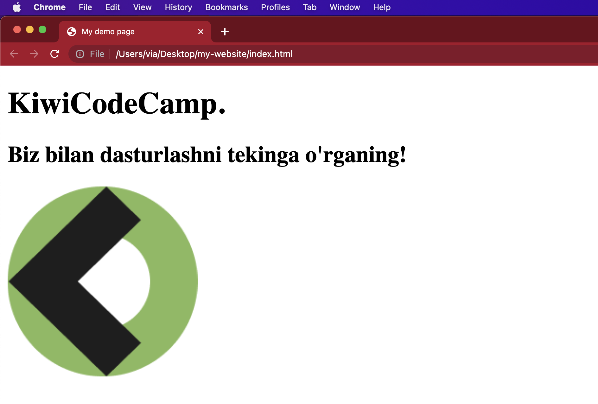
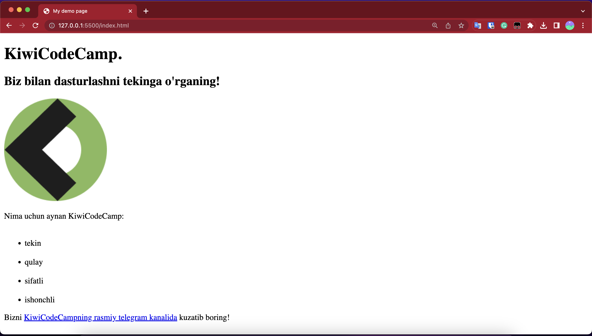

# HTML mini website

Avvalgi darsda boshlab qo'ygan "birinchi" HTML loyihamizni davom ettiramiz.

## Images

`` elementiga yana e'tibor beraylik:

```html

```

Yuqorida aytib o'tganimizdek, `` sahifamizga rasmni o'zi qayerga yozilgan bo'lsa o'sha tartib bilan joylashtiradi.

Shuningdek, biz `alt` (aleternative) atributni ham kiritdik. Alt atributida siz tasvirni ko'ra olmaydigan foydalanuvchilar uchun o'sha rasmni tavsiflovchi matnni belgilaysiz, ehtimol quyidagi sabablarga ko'ra:

1. Ko'zi ojiz foydalanuvchilari uchun. Ko'rish qobiliyati sezilarli darajada zaif bo'lgan foydalanuvchilar ko'pincha *alt*dagi matnni o'qish uchun "screen reader" deb nomlangan vositalardan foydalanadilar. Shu yo'l bilan ular rasmni ko'rishmasa ham rasm nima ekanini his qilishlari mumkin.

2. Biror narsa noto'g'ri ketdi va rasm 'load' bo'lmay qoldi. Ushbu holatda browser rasmni o'rniga *alt*dagi matnni ko'rsatadi. Masalan, men `src="images/kiwicode-logo.png"` noto'g'ri qilib hato yazsam, deylik `src="images/kiwi-logo.png"`, shunda biz vebsahifamizda taxminan mana bunday yozuv ko'ramiz:



:::tip Accessibility

Yuqoridaginday "imkoniyati cheklanglar" uchun yaxshi _software_ yarata olish **accessibility** deb ataladi. Bu borada alohida o'qishadi. Agarda ko'proq ma'lumot bilmoqchi bo'lsangiz unda [ushbu manbani](https://developer.mozilla.org/en-US/docs/Learn/Accessibility) maslahat beraman.

:::

## Marking up text (matnni belgilash)

Ushbu qism text (matn) yozishda foydalanadigan HTML elementlari haqida bo'ladi. (Ishoning, qiziq joylari endi kelyapti 😁)

### Headings (sarlavha)

Kitoblarda bo'lgani kabi, HTML website dan ham sarlavha bo'ladi va u **heading** deb ataladi. HTMLda 6ta darajadigi sarlavhalarni ifodalash mumkin:

```html
<!-- 6ta heading darajalari: -->

<h1>Hello World (h1)</h1>
<h2>Hello World (h2)</h2>
<h3>Hello World (h3)</h3>
<h4>Hello World (h4)</h4>
<h5>Hello World (h5)</h5>
<h6>Hello World (h6)</h6>
```

Yuqoridagi HTML browserda mana bu ko'rinishda bo'ladi👇:

<iframe width="100%" height="400" src="//jsfiddle.net/nomanoff/juzgy283/1/embedded/result/" allowfullscreen="allowfullscreen" allowpaymentrequest frameborder="0"></iframe>

:::tip HTML comments

Yuqoridagi *HTML*ga e'tibor bersangiz `<!-- 6ta heading darajalari: -->` yozuvni ko'rshingiz mumkin. *HTML*da birorta qatorda yozilgan _code_ haqida _comment_ (izoh)
berib ketmoqchi bo'lsangiz `<!-- ... --> `shularning ichiga yozishingiz mumkin. Bularni ichiga yozilgan *text*ni browserlar o'qimaydi va render qilib foydalanuvchiga ko'rsatmaydi. Bu shunchaki dasturchi uchun ko'rinib turadi.
Vaqtinchalik ishlatilmayotgan _html_ *code*ni ham berkitib qo'yish uchun ishlatsa bo'ladi.
:::

Birgalida yasayotgan mini websiteimizga birorta sarlavha qo'yib ko'ramiz:

Masalan:

```html title="index.html"
<!DOCTYPE html>
<html lang="en-US">
  <head>
    <meta charset="utf-8" />
    <meta name="viewport" content="width=device-width" />
    <title>My demo page</title>
  </head>
  <body>
    <h1>KiwiCodeCamp.</h1>
    <h2>Biz bilan dasturlashni tekinga o'rganing!</h2>

    
  </body>
</html>
```

Yana `index.html` faylni browserda ochib ko'ramiz:



## Paragraphs (paragraphlar)

HTMLda paragraf `<p>`, blok elementlardan biridir va ko'p qatorli matnni ko'rsatish uchun foydalaniladi.

`<p>This is a single paragraph</p>`

## HTML lists (ro'yxatlar)

HTML-da ro'yxatlar turli usullarda yaratilishi mumkin. Ro'yxatlar HTML-da tahrir qilinishi va shakllantirilishida katta ahamiyatga ega bo'lib, matnni ko'rsatish uchun yordam beradi. Ro'yxatlar, _tartiblangan_ (ordered lists) `<ol></ol>` va _tartiblanmagan_ (unordered lists) `<ul></ul>` bo'lishi mumkin.

### Ordered lists:

```html
<ol>
      
  <li>HTML</li>
      
  <li>CSS</li>
      
  <li>JavaScript</li>
      
  <li>Node.js</li>
</ol>
```

<iframe width="100%" height="300" src="//jsfiddle.net/nomanoff/c0ebfsm4/3/embedded/result/" allowfullscreen="allowfullscreen" allowpaymentrequest frameborder="0"></iframe>

`<ol> `tegi ro'yxatni boshlaydi va `<li>` teglari har bir ro'yxat elementini ifodalaydi. Ro'yxat elementlari tartiblangan bo'lib, ularni sonlar bilan belgilash mumkin. Bu yerda, ro'yxat elementlarini "HTML", "CSS", "JavaScript" va "Node.js" deb belgilangan.

### Unordered lists:

Tartiblanmagan ro'yxat HTML-da quyidagi *tag*lar orqali yaratiladi:

```html
<ul>
      
  <li>tekin</li>
      
  <li>qulay</li>
      
  <li>sifatli</li>
      
  <li>ishonchli</li>
</ul>
```

<iframe width="100%" height="300" src="//jsfiddle.net/nomanoff/L92xkstb/1/embedded/result/" allowfullscreen="allowfullscreen" allowpaymentrequest frameborder="0"></iframe>

## Links (havolalar)

Linklarni o'rganish juda ham muhim. Chunki, webni web qiladigan ham linklardir. Vebsahiga link qo'shish uchun bizga `<a>` ("a" - "anchor" so'zidan kelgan) tagidan foydalanamiz.

1. Quyida ko'rsatilganday linkga aylantirmoqchi bo'lgan textni `a` taglari orasiga olamiz:

```html
<a>KiwiCodeCamp Telegram kanali</a>
```

2. Endi unga `href` attribute qo'shing:

```html
<a href="">KiwiCodeCamp Telegram kanali</a>
```

3. End `href`ni birorta link bilan to'ldiring. Misol uchun telegram kanalimizga ulaymiz:

```html
<a href="https://t.me/kiwicodecamp">KiwiCodeCamp Telegram kanali</a>
```

Endi websitemizga barcha o'rganganlarimizni qo'yib yozib koramiz:

## Final version ✅

```html title="index.html"
<!DOCTYPE html>
<html lang="en-US">
  <head>
    <meta charset="utf-8" />
    <meta name="viewport" content="width=device-width" />
    <title>My demo page</title>
  </head>
  <body>
    <h1>KiwiCodeCamp.</h1>
    <h2>Biz bilan dasturlashni tekinga o'rganing!</h2>

    

    <p>Nima uchun aynan KiwiCodeCamp:</p>

    <ul>
          
      <li>tekin</li>
          
      <li>qulay</li>
          
      <li>sifatli</li>
          
      <li>ishonchli</li>
    </ul>

    <p>
      Bizni
      <a href="https://t.me/kiwicodecamp"
        >KiwiCodeCampning rasmiy telegram kanalida</a
      >
      kuzatib boring!
    </p>
  </body>
</html>
```

Yuqoridagi html codening browserdagi ko'rinishi:



Tabriklations! 🥳 Endi siz HTMLni bilasiz! 🤓 (hmm..., deyarli 😅)
