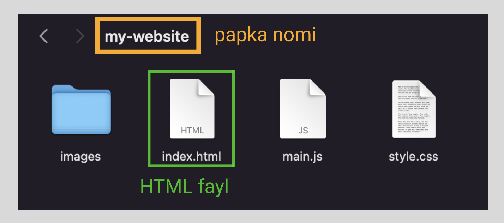

# HTML coding practice

## Fayllar bilan ishlash

**Website**(veb-sahifa) bir nechta fayllardan iborat bo'ladi. Eng oddiy *website*ning _"papka"_ ko'rinishi shunga o'xshaydi:



`index.html`: Ushbu fayl HTML codeni o'z ichiga oladi.

`style.css`: Ushbu faylda kontentingizni style berish uchun foydalaniladigan CSS kodlari bo'ladi (masalan, matn va fon ranglarini o'zgartish).

`main.js`: Ushbu faylda saytingizga interaktiv funksiyalar qoʻshish uchun foydalaniladigan barcha JavaScript code yoziladi (masalan, bosilganda websahifa rangini o'zgartiradigan tugmalar).

`images` papkasi: Ushbu papkada saytingizda foydalanadigan barcha rasmlar saqlanadi.

## Kichik websayt(cha)

Keling bir kichik websayt yasab ko'ramiz 🤓. Kompyuteringizning birorta papkasida, masalan Desktop, `my-website` degan papka oching va uning ichiga yuqoridagi rasmda ko'rsatilgan fayllarni yasang.

`my-website` degan papka ushbu ko'rinishda bo'lishi kerak:

## HTML5 template(shabloni)

Shunday qilib *element*lar haqida basic(boshlang'ich) tushunchaga ega bo'ldingiz. (Yoki shunday deb umid qilaman 😅). Lekin, *element*larning o'zlari unchalik ham foydali emas. Hamma kuch turli xil elemenetlarni birlashtirib butun boshli _HTML page_ yaratishda dir 💪.
Yangi veb-sayt qurayotganda, yaxshi boshlang'ich poydevorga ega bo'lish muhimdir.

Quyida, har qanday HTML project(loyiha) yasashda ishlatiladigan, eng oddiy **HTML5 boilerplate**(template) ni ko'rishingiz mumkin:

```html title="index.html"
<!DOCTYPE html>
<html lang="en">
  <head>
    <meta charset="UTF-8" />
    <meta name="viewport" content="width=device-width, initial-scale=1.0" />
    <meta http-equiv="X-UA-Compatible" content="ie=edge" />
    <title>HTML 5 Boilerplate</title>
    <link rel="stylesheet" href="style.css" />
  </head>
  <body>
    <script src="index.js"></script>
  </body>
</html>
```
