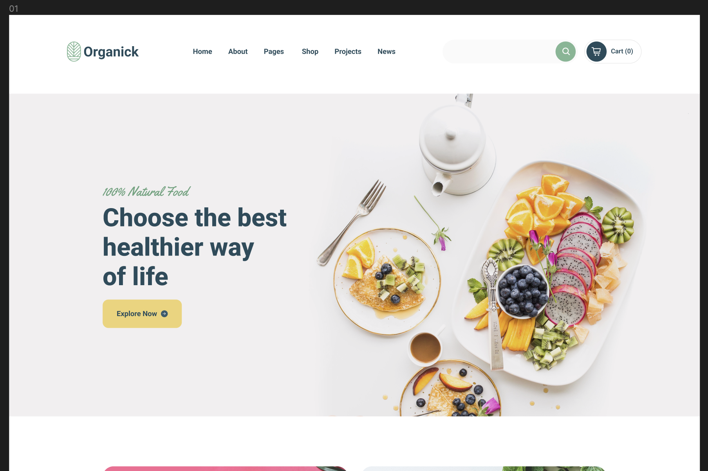

# Welcome 👋

**kiwiCodeCamp**ga hush kelibsiz 🎉.

:::tip Maslahat

Ushbu vebsaytga yangi kelib turgan bo'lsangiz, avval men yozgan [blog post](/blog/welcome-blog-post)ni o'qishingizni maslahat beraman.

:::

Bu yerda biz web dasturlashni asoslari bo'lgan **HTML**, **CSS**, va **JavaScript**ni o'rganamiz. Keyinchalik zamonaviy web frameworklari - **React**, **Next.js**, **React Native**, va **Node.js** kabilarni ham ishlatgan holda bir nechta _real-world_ loyihalarni ham yasaymiz.

Shunday qilib, siz yangi boshlovchi yoki shunchaki mahoratingizni yangilamoqchi bo'lsangiz, ushbu qiziqarli sayohatga qo'shiling!

:::danger Ogohlantirish

Men _web_ dasturlashni ingliz tilida o'rganganim va dasturlashdagi atamalarni o'zbekchada bilmaganim uchun, inglizcha so'zlar bilan aralashtirib yozyapman. Agarda birorta so'zni tushunmay qolsanglar [Telegram guruhi](https://t.me/kiwi_logs)dan so'rashingiz mumkin ✅.
Imloviy hatolarimga ham e'tibor bermaysizlar 😅.

:::

## Biz boshladik!

**Web dasturlashni** o'rgatishda ko'pchilik mentorlar "internet", "browser" yoki HTML sintaktikasi va h.k. lardan o'rgana boshlaydi. Men sal boshqacharoq yo'l tutmoqchiman va o'zim ham shu yo'l bilan boshlaganman. Ya'ni, avvaliga biz o'zimizni testdan o'tkazishimiz kerak bo'ladi. Buning uchun men sizlarga 1-2 soatlik video beraman va ushbu videoda biz birgalikda bitta kichik website yasaymiz. Birinchi darsdanoq siz o'zingizni birinchi veb sahifangizni yasaysiz. Albatta boshlanishiga biz JavaScript yoki murakkab _library_ dan foydalanmaymiz. Shunchaki HTML va CSSdan foydalangan holda biz ushbu websiteni yasaymiz:

<!--  -->

### Nimalar kerak bo'ladi

- Albatta, kompyuter 😁. Mac, Windows, Linux, farqi yo'q. Pastdagilarni 👇 o'rnatganda ishlasa bo'ldi.

  - Men darslarimda Mac ishlataman (Apple fanboy 🙃) lekin Windows ishlatuvchilarga ham yordam berib ketishga harakat qilaman.

- [Google Chrome](https://www.google.com/chrome/) web browseri. (O'ylaymanki [Internet Explorer](https://www.microsoft.com/en-us/download/internet-explorer.aspx)ni hech kim ishlatmay qo'ygan. 😅)

  - Agar **Chrome**ni o'rnata olmasangiz [Microsoft Edge](https://www.microsoft.com/en-us/edge/download?form=MA13FJ) ham bo'ladi.

- [Brackets](https://brackets.io/) yoki [VS Code](https://code.visualstudio.com/)

  - Ikkalasi ham yaxshi. Men ishda **VS Code**dan foydalanaman. Yangi boshlovchilar uchun **Brackets**ni tafsiya qilaman. Chunki, Brackets ishlatishga qulay va ortiqcha _configuration_ talab qilmaydi.
  - Ikkovi ham Mac, Windows, va Linuxda ishlaydi. O'rnatishga qiynalsangiz Telegram guruhimizdan yordam so'rang^^.

- Hozircha shular. Agarda yana nimadir kerak bo'lib qolsa videoda aytib ketaman.

## Youtube Video

Agarda kerakli narsalarni o'rnatib olgan bo'lsangiz videoni ko'rishingiz va _code_ yozishni boshlashingiz mummkin.

  <iframe width="560" height="315" src="https://www.youtube.com/embed/7r8nqIiZkec" frameborder="0" allow="autoplay; encrypted-media" allowfullscreen></iframe>

## Videodan eslatmalar:
