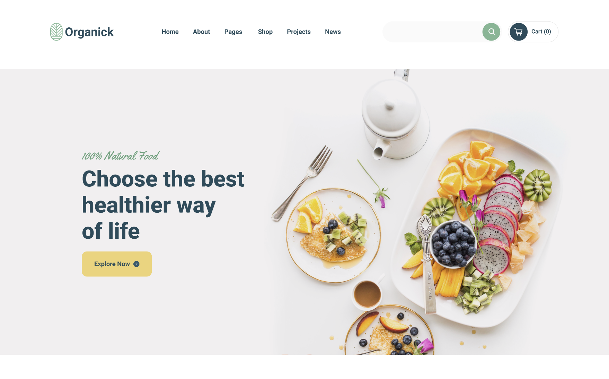

# Welcome 👋

**kiwiCodeCamp**ga hush kelibsiz 🎉.

:::tip Maslahat

Ushbu vebsaytga yangi kelib turgan bo'lsangiz, avval men yozgan [blog post](/blog/welcome-blog-post)ni o'qishingizni maslahat beraman.

:::

Bu yerda biz web dasturlashni asoslari bo'lgan **HTML**, **CSS**, va **JavaScript**ni o'rganamiz. Keyinchalik zamonaviy web frameworklari - **React**, **Next.js**, **React Native**, va **Node.js** kabilarni ham ishlatgan holda bir nechta _real-world_ loyihalarni ham yasaymiz.

Shunday qilib, siz yangi boshlovchi yoki shunchaki mahoratingizni yangilamoqchi bo'lsangiz, ushbu qiziqarli sayohatga qo'shiling!

:::danger Ogohlantirish

Men _web_ dasturlashni ingliz tilida o'rganganim va dasturlashdagi atamalarni o'zbekchada bilmaganim uchun, inglizcha so'zlar bilan aralashtirib yozyapman. Agarda birorta so'zni tushunmay qolsanglar [Telegram guruhi](https://t.me/kiwi_logs)dan so'rashingiz mumkin ✅.
Imloviy hatolarimga ham e'tibor bermaysizlar 😅.

:::

## Biz boshladik!

**Web dasturlashni** o'rgatishda ko'pchilik mentorlar "internet", "browser" yoki HTML sintaktikasi va h.k. lardan o'rgana boshlaydi. Men sal boshqacharoq yo'l tutmoqchiman va o'zim ham shu yo'l bilan boshlaganman. Ya'ni, avvaliga biz o'zimizni testdan o'tkazishimiz kerak bo'ladi. Buning uchun men sizlarga 1-2 soatlik video beraman va ushbu videoda biz birgalikda bitta kichik website yasaymiz. Birinchi darsdanoq siz o'zingizni birinchi veb sahifangizni yasaysiz. Albatta boshlanishiga biz JavaScript yoki murakkab _library_ dan foydalanmaymiz. Shunchaki HTML va CSSdan foydalangan holda biz ushbu websiteni yasaymiz:

<!--  -->


### Nimalar kerak bo'ladi

- [Brackets](https://brackets.io/) yoki [VS Code](https://code.visualstudio.com/)
  - Ikkalasi ham yaxshi. Men ishda **VS Code**dan foydalanaman. Yangi boshlovchilar uchun **Brackets**ni tafsiya qilaman. Chunki, Brackets ishlatishga qulay va ortiqcha _configuration_ talab qilmaydi.
  - Ikkovi ham Mac, Windows, va Linuxda ishlaydi. O'rnatishga qiynalsangiz Telegram gr dan yordam so'rang^^.

## Generate a new site

Generate a new Docusaurus site using the **classic template**.

The classic template will automatically be added to your project after you run the command:

```bash
npm init docusaurus@latest my-website classic
```

You can type this command into Command Prompt, Powershell, Terminal, or any other integrated terminal of your code editor.

The command also installs all necessary dependencies you need to run Docusaurus.

## Start your site

Run the development server:

```bash
cd my-website
npm run start
```

The `cd` command changes the directory you're working with. In order to work with your newly created Docusaurus site, you'll need to navigate the terminal there.

The `npm run start` command builds your website locally and serves it through a development server, ready for you to view at http://localhost:3000/.

Open `docs/intro.md` (this page) and edit some lines: the site **reloads automatically** and displays your changes.
